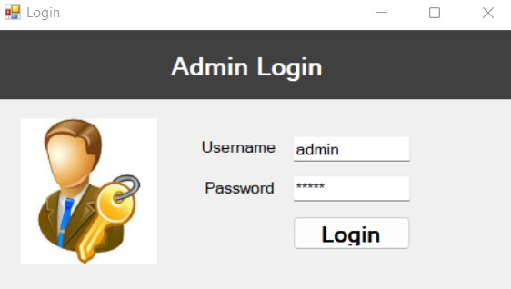
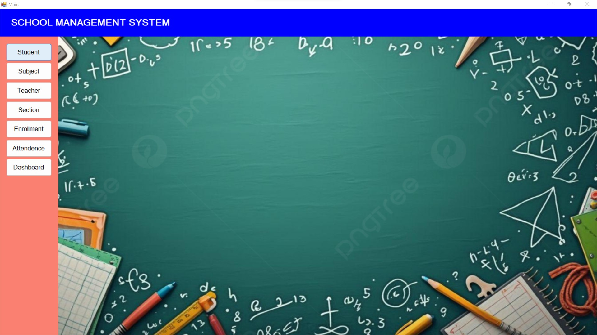
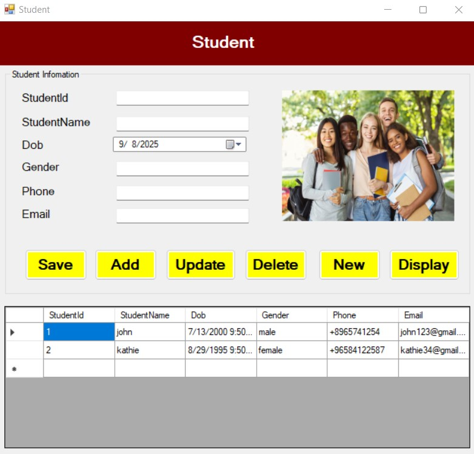
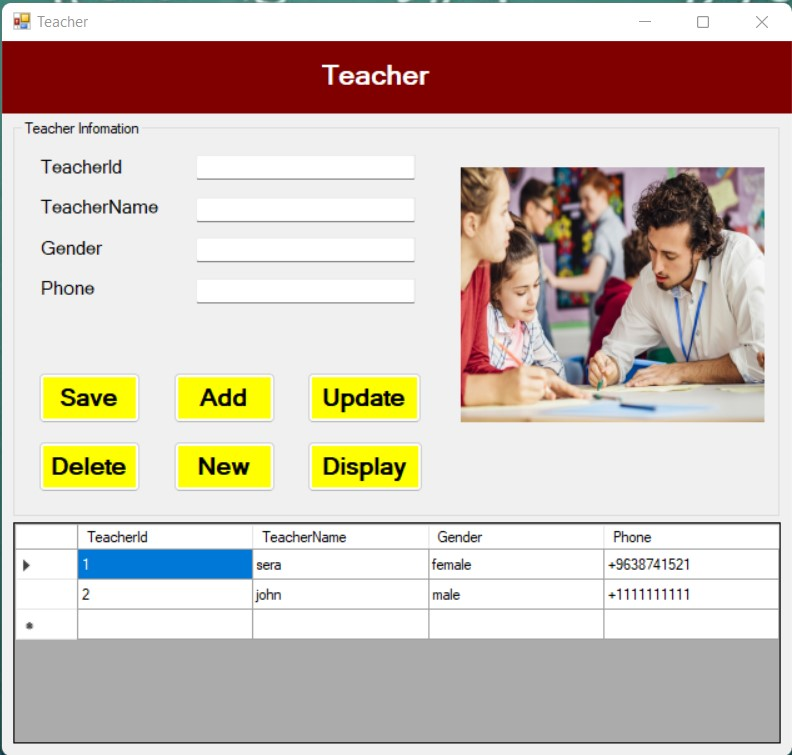
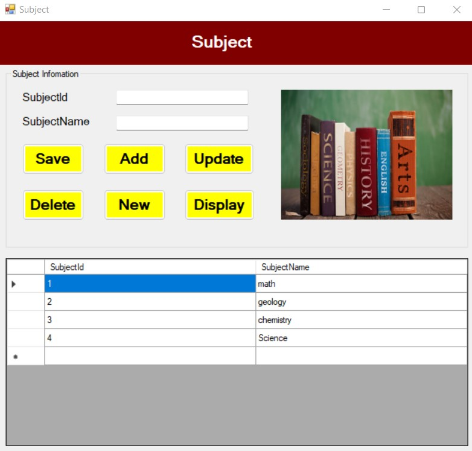
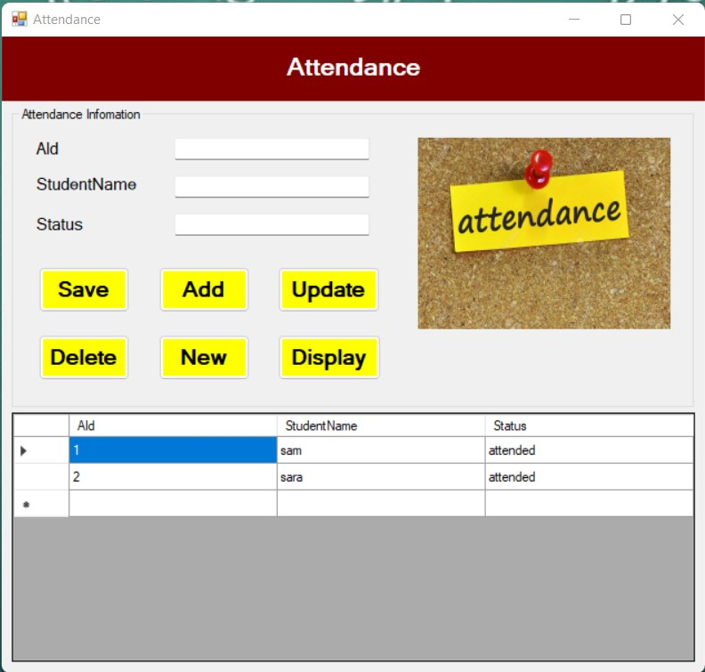
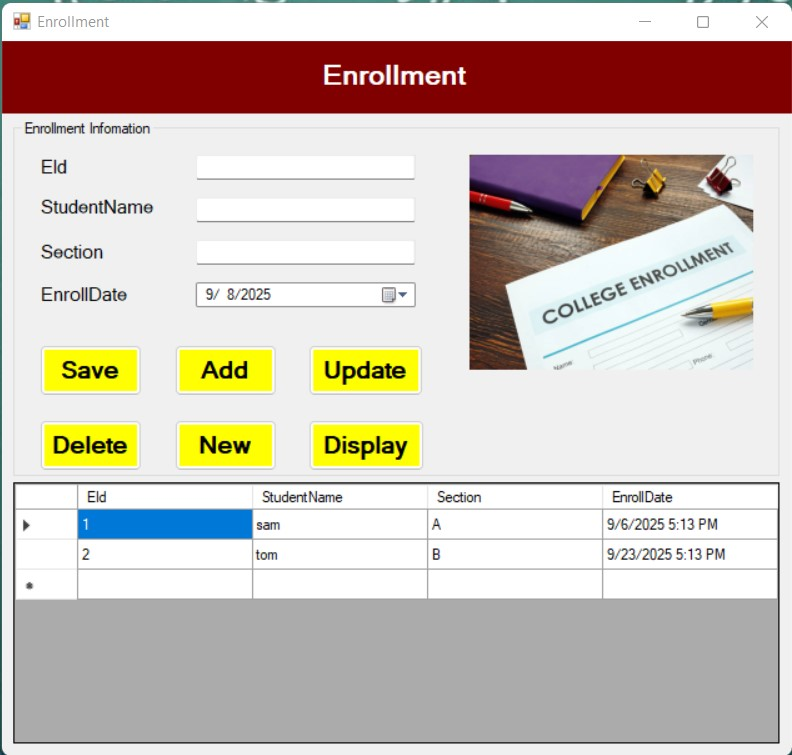
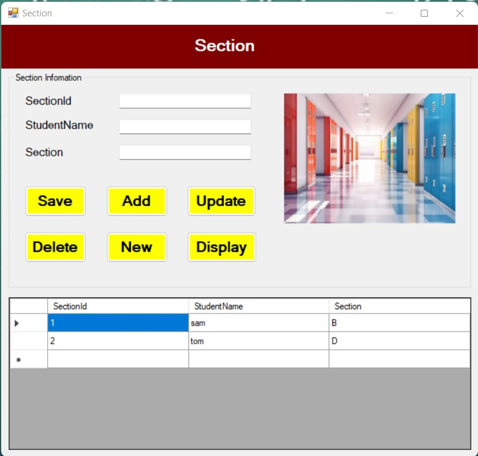
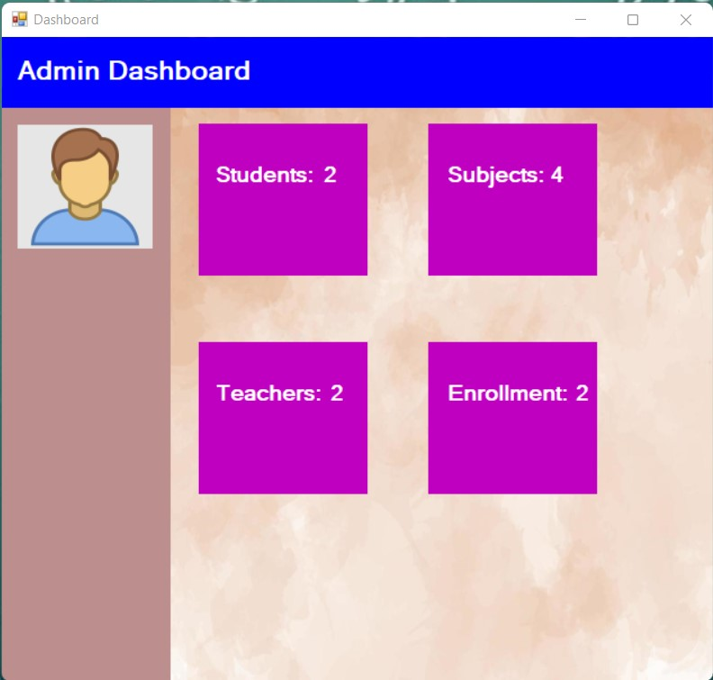
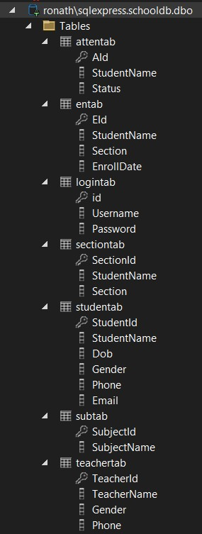

# School Management System

The **School Management System** is a comprehensive desktop application built using **C#.NET and SQL Server**. It streamlines the process of managing students, teachers, subjects, attendance, enrollment, and other administrative tasks within a school.

---


## Project Overview

This project is designed to simplify school administration by providing an intuitive and secure platform for managing essential school records. It includes functionalities for student enrollment, teacher information, subject management, and attendance tracking. A dedicated admin panel allows centralized control over all operations.

---

## Key Features

* **Admin Authentication:** Secure login for administrators.
* **Student Management:** Add, update, view, and delete student records.
* **Teacher Management:** Maintain teacher details including personal and contact information.
* **Subject & Section Management:** Organize academic subjects and their sections.
* **Enrollment System:** Enroll students into specific sections and subjects.
* **Attendance Tracking:** Record and review attendance history for students.
* **Dashboard Overview:** Quick summary of key statistics and activities.
* **Database Integration:** Stores all information securely in SQL Server.

---

## Technologies Used

* **Programming Language:** C#.NET
* **Framework:** .NET Framework (Windows Forms)
* **Database:** SQL Server (LocalDB or Express)
* **IDE:** Microsoft Visual Studio
* **Additional Tools:** SQL Server Management Studio (SSMS)

---

## Database Structure

This system uses a SQL Server database named **`schooldb`** with the following main tables:

* `studentab` – Stores student details (ID, name, DOB, gender, phone, email).
* `teacherab` – Stores teacher details.
* `subjectab` – Stores subjects offered by the school.
* `sectionab` – Stores academic sections/classes.
* `enrollmentab` – Tracks student enrollment per section/subject.
* `attendanceab` – Records attendance logs for each student.

---

## Installation Guide

1. **Clone the Repository**

   ```bash
   git clone https://github.com/yourusername/school-management-system.git
   ```

2. **Open in Visual Studio**

   * Launch Visual Studio and open the `.sln` file.

3. **Set Up the Database**

   * Open SQL Server Management Studio (SSMS).
   * Create a new database named `schooldb`.
   * Run the SQL script provided in the `database` folder (if included) to generate tables.

4. **Configure Connection String**

   * In `Student.cs` (and other related files), update the connection string:

   ```csharp
   SqlConnection con = new SqlConnection(@"Data Source=RONATH\sqlexpress;Initial Catalog=schooldb;Integrated Security=True");
   ```

5. **Build and Run**

   * Press `F5` in Visual Studio to build and launch the application.

---

## How to Use

1. **Login** with admin credentials (default or configured).
2. **Navigate through dashboard** to access student, teacher, subject, and section management.
3. **Perform CRUD operations** (Create, Read, Update, Delete) for records.
4. **Use attendance module** to mark or view attendance.
5. **View dashboard summaries** for an overview of current data.

---

## Screenshots


      











---

## Future Improvements

* Role-based access for teachers and students.
* Web version using ASP.NET Core for online access.

---


